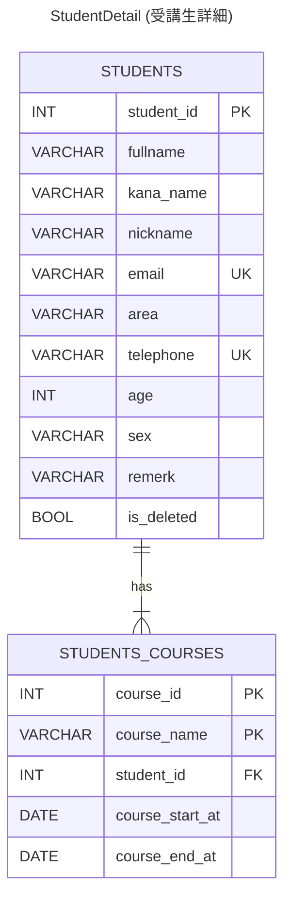
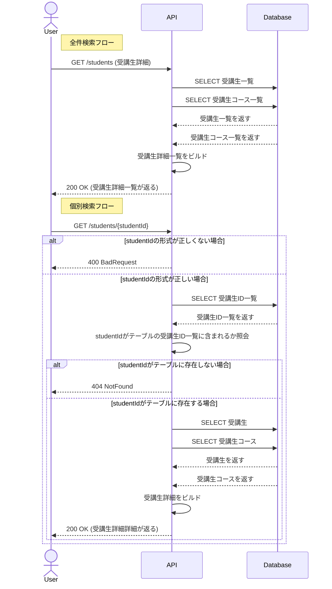
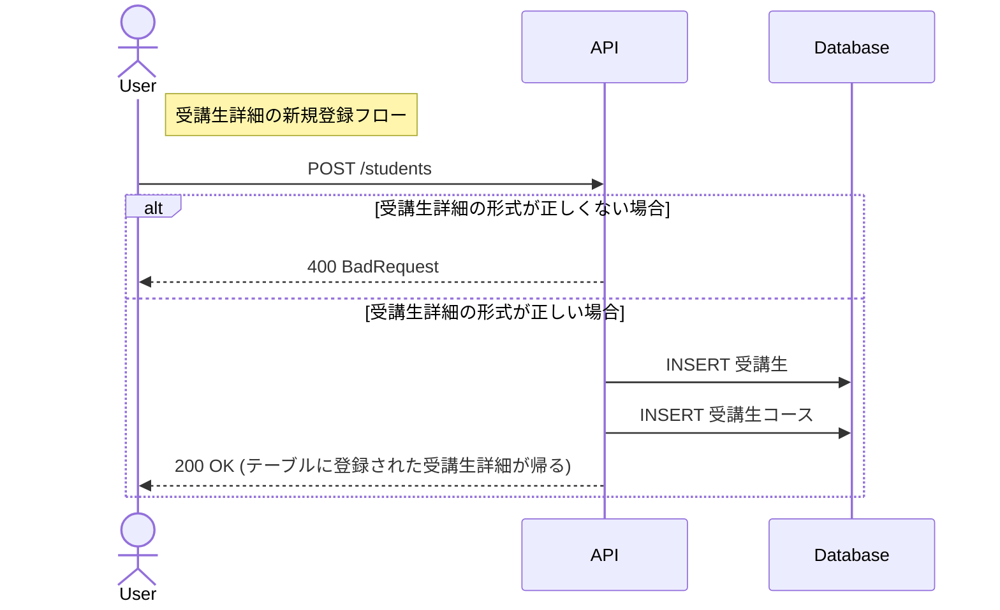
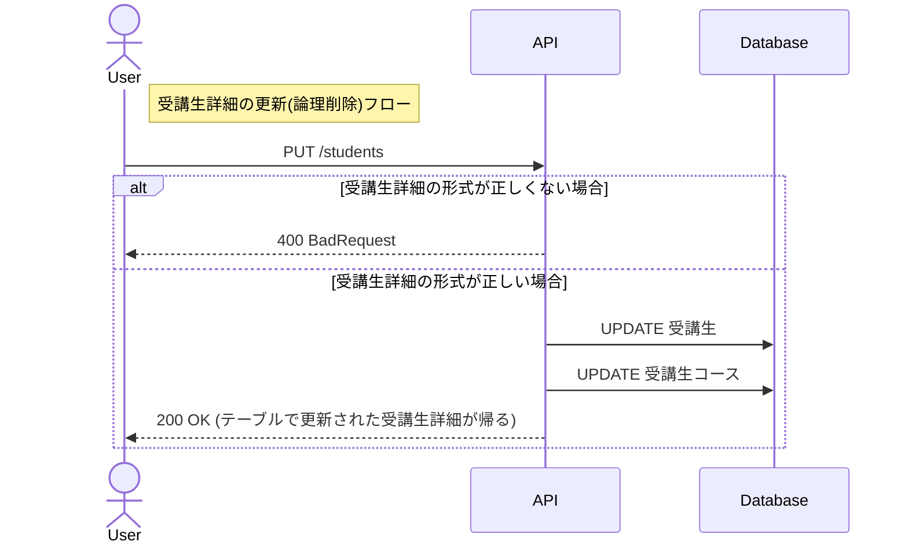
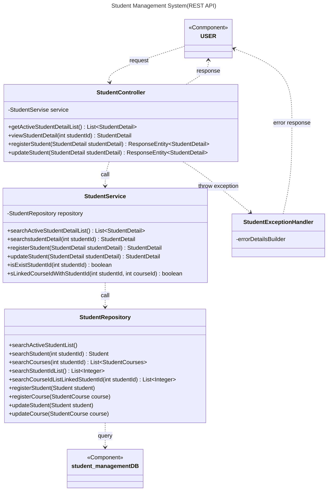
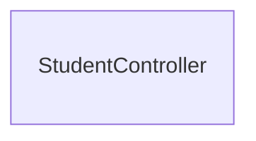

# 受講生管理システム

***

## 概要

---
所属しているスクール（RaiseTech）の課題で作成しています。  
架空のプログラミングスクールの受講生の運営スタッフがプロフィールと受講コース情報を管理するためのREST APIです。このAPIは、以下の操作を行うことができます。

・受講生詳細の全件検索  
・受講生詳細の個別検索(受講生ID指定)  
・受講生詳細の新規登録  
・受講生詳細の更新（論理削除を含む）

詳細なAPI仕様は、以下のリンクから確認できます。  
[受講生管理システム(Swagger UI)](https://saway261.github.io/StudentManagement/)

## 詳細

---
### 開発環境

**使用技術**  

**使用ツール**  

---
### E-R図(データモデル) Entity-Relation Diagram
受講生と受講生コースは1対多の関係を持つ。受講生と、その受講生のすべてのコースの情報で受講生詳細(studentDetail)を組み立てる

---
### シーケンス図 Sequence Diagramm

---

### クラス図 Class Diagram

---
## 力を入れた点
### ・例外の種類のよらないエラーレスポンスフォーマットの形成

## 今後の課題
・テストの実施および現時点で想定できていないエラーハンドリングの実装  
・柔軟な検索機能の実装（受講生ID以外による検索を可能にする）